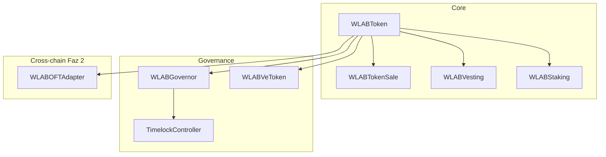

# WhiteLab ($WLAB) — Sunum ve Kurulum Rehberi

Bu dosya projeyi **tek başına sunabileceğin** eksiksiz rehberdir: ne olduğu, nasıl çalıştığı, nasıl ayağa kaldırılacağı ve nerede durduğu.

---

## 1. Proje Özeti (30 saniyelik pitch)

**WhiteLab Launch OS**, Base zinciri üzerinde kurumsal uyumlu bir token launch protokolüdür.

| Özellik | Değer |
|---------|--------|
| Token | **WLAB** — max 1 milyar |
| Zincir | Base Sepolia (test) → Base (mainnet) |
| Monorepo | 8 akıllı sözleşme + 9 doküman + test + deploy |
| Durum | **Production candidate** — 50 test, P0 kapalı; marketing site + console |

**Ne yapar?**

- **WLABToken** — ERC-20 + oy (votes) + permit + compliance (blacklist, fee, pause)
- **WLABTokenSale** — 3 fazlı IDO (Seed / Private / Public), Merkle whitelist, refund, claim
- **WLABVesting** — cliff + linear vesting
- **WLABStaking** — 4 kilit süresi, ödül, acil çıkış cezası
- **WLABGovernor** + **Timelock** — DAO oylama (%4 quorum)
- **WLABVeToken** — vote-escrow (veCRV tarzı)
- **WLABOFTAdapter** — cross-chain stub (LayerZero Faz 2)
- **WLABTreasuryUUPS** — upgradeable hazine (UUPS)

---

## 2. Mimari (tek bakışta)



**Deploy sırası** (`scripts/deploy.js`):

1. WLABToken  
2. WLABVesting, WLABStaking  
3. TimelockController → WLABGovernor  
4. WLABTokenSale (100M WLAB IDO fonu otomatik transfer)  
5. WLABVeToken, WLABOFTAdapter  
6. Adresler → `deployments/<network>.json`

---

## 3. P0 Düzeltmeler (Launch blocker — TAMAMLANDI)

### Bug 1 — Transfer fee + ERC20Votes checkpoint

**Sorun:** Fee alınırken `from` için 3 kez `super._update` → oy gücü checkpoint'leri bozuluyordu.

**Çözüm:** Net transfer + tek fee transfer (`from → feeReceiver`) + burn (`feeReceiver → 0`).

**Test:** `WLABToken.test.js` → `P0 votes: getVotes correct after fee-bearing transfer`

### Bug 2 — IDO alıcıları token alamıyordu

**Sorun:** `buy()` ödeme topluyordu ama `purchasedTokens` yoktu; `claimVested` yanlış tasarlanmıştı.

**Çözüm:**

- `purchasedTokens[phase][buyer]` kaydı
- `claim(phase)` — finalize sonrası alıcı kendi tokenını çeker
- `refund()` — entitlement sıfırlama
- `recoverUnsoldTokens()` — satılmayan tokenları hazineye

**Test:** `WLABTokenSale.test.js` — E2E buy → finalize → claim (7 senaryo)

---

## 4. Projeyi Ayağa Kaldırma (adım adım)

### Ön koşullar

- **Node.js 18+** ve **npm** ([nodejs.org](https://nodejs.org))
- Testnet için **Base Sepolia ETH** ([faucet](https://www.coinbase.com/faucets/base-ethereum-goerli-faucet))
- **Basescan API key** ([basescan.org](https://basescan.org/myapikey))

### Adım 1 — Ortam

```bash
cd whitelab
cp .env.example .env
```

`.env` içinde doldur:

```env
PRIVATE_KEY=your_key_without_0x
ETHERSCAN_API_KEY=your_basescan_key
TREASURY_ADDRESS=0xYourTreasuryOptional
```

### Adım 2 — Kurulum ve derleme

```bash
npm install
npx hardhat compile
```

### Adım 3 — Testler (26 test, 0 fail beklenir)

```bash
npm test
```

Beklenen çıktı: `26 passing`

### Adım 4 — Base Sepolia deploy

```bash
npm run deploy:sepolia
```

Başarılı olunca `deployments/baseSepolia.json` dolu adreslerle güncellenir.

### Adım 5 — Basescan verify

```bash
npm run verify
```

Mainnet için: `npm run deploy:base` → `npm run verify:base`

---

## 5. Divine Bitirici Komut (kopyala-yapıştır)

```bash
cd whitelab
cp .env.example .env
# .env içinde PRIVATE_KEY ve ETHERSCAN_API_KEY doldur
npm install
npx hardhat compile
npm test
npm run deploy:sepolia
npm run verify
```

---

## 6. IDO Akışı (demo / sunum)

Sunumda canlı veya Hardhat console ile gösterilecek akış:

1. **Owner** `configurePhase` + `startPhase` (Public = faz 3)
2. **Alıcı** `buy(tokenAmount, merkleProof)` + ETH gönderir
3. **Owner** `finalizeSale()` — soft cap geçildiyse başarılı
4. **Alıcı** `claim(phase)` — WLAB cüzdanına gelir
5. **Owner** `withdrawFunds(treasury)` — toplanan ETH

Soft cap altında kalınırsa: `refundsEnabled = true` → alıcılar `refund(phase)` çağırır.

---

## 7. Test Kapsamı

| Dosya | Ne test eder |
|-------|----------------|
| `WLABToken.test.js` | Mint, pause, blacklist, fee, **P0 votes** |
| `WLABTokenSale.test.js` | IDO, claim, refund, double-claim, withdraw |
| `WLABVesting.test.js` | Cliff, release, revoke |
| `WLABStaking.test.js` | Stake, reward, emergency |
| `WLABGovernor.test.js` | Deploy, quorum |
| `integration.test.js` | Tam IDO + stake + vesting |

---

## 8. Tamamlanma Durumu

| Katman | Durum | Not |
|--------|--------|-----|
| Dokümantasyon (`docs/`) | ~95% | Bölüm 0–9 hazır |
| Kontratlar | ~90% | P0 kapalı, OFT stub |
| Testler | **26/26** | Lokal doğrulandı |
| Deploy | Kullanıcı | `.env` + Sepolia ETH gerekir |
| Audit / Legal | Yol haritası | Mainnet öncesi zorunlu |

**Pragmatik “Completed MVP” tanımı:** Docs + P0 fix + tüm testler + Sepolia deploy + verify.

---

## 9. P1 — Senin aksiyonun (production kalitesi)

| Görev | Komut |
|-------|--------|
| Coverage | `npm run coverage` (hedef ≥95%) |
| Slither | `pip install slither-analyzer` → `slither contracts/` |
| Sepolia deploy | `npm run deploy:sepolia` |
| Verify | `npm run verify` |

---

## 10. P2–P3 — Roadmap (değişmedi)

- LayerZero OFT gerçek implementasyon
- Gnosis Safe 4/7 multisig admin
- Tier-1 audit (OZ / Certik)
- Uniswap v3 LP kilidi
- Immunefi bug bounty

---

## 11. Dizin Yapısı

```
whitelab/
├── contracts/          # 8 Solidity sözleşmesi
├── test/               # 6 test dosyası (26 test)
├── scripts/            # deploy.js, verify.js
├── deployments/        # base-sepolia.json (deploy sonrası)
├── docs/               # Master rehber 0–9
├── claude-handoff/     # AI devam paketi
├── SUNUM.md            # Bu dosya
├── README.md           # Hızlı başlangıç
└── ARCHITECT_LOG.md    # Mimari karar logu
```

---

## 12. Yasal uyarı

Bu repo **eğitim ve geliştirme** amaçlıdır. Canlı mainnet, halka açık satış veya yatırım teklifi öncesi **profesyonel hukuki danışmanlık** ve **Tier-1 güvenlik denetimi** zorunludur.

---

*Son güncelleme: P0 fix + 26 passing test — sunuma hazır MVP.*
