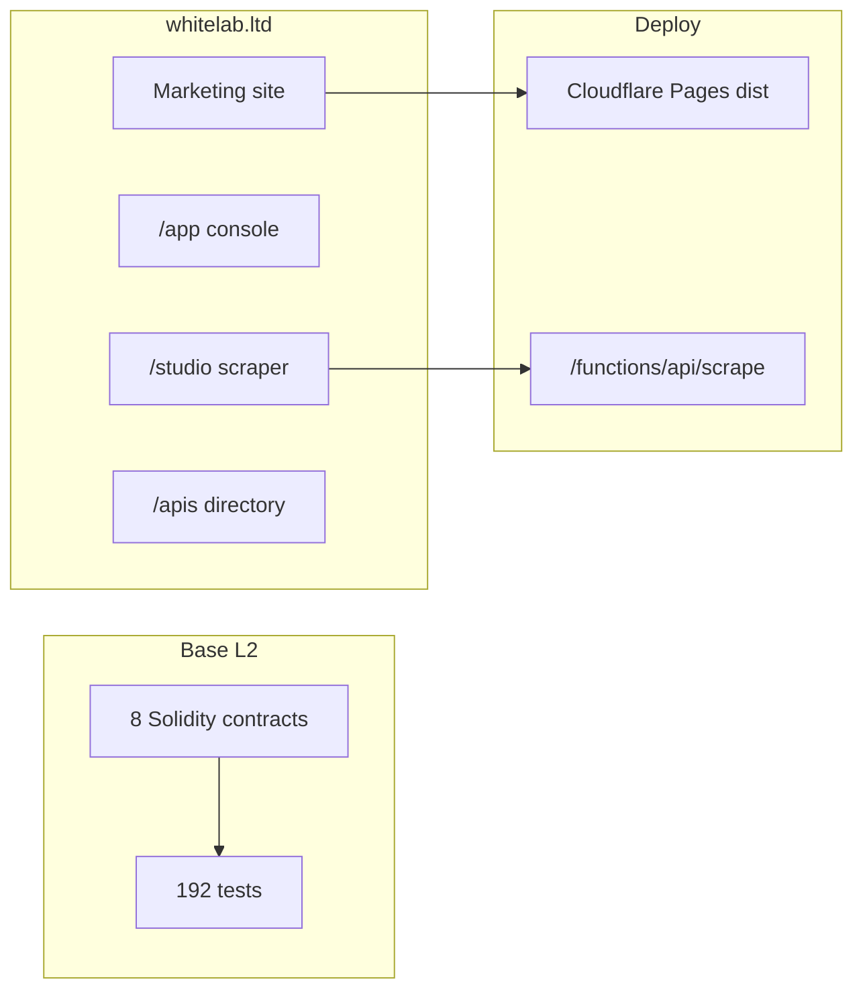

# WhiteLab — Sonnet Devam

**Tarih:** 2026-05-30  
**Amaç:** Claude Sonnet 4.6 için güncel giriş kapısı. Eski `claude-handoff/` paketini silmez; onun üzerine oturur.

---

## Tek cümle

WhiteLab, Base L2 üzerinde çalışan bir **launch işletim sistemi** — altta Hardhat kontratları, üstte whitelab.ltd sitesi, launch console ve freelancer/ajans aracı Studio.

Para birimi: **$WLAB**. Max arz: **1 milyar**. Zincir: **Base**. Durum: **testnet adayı, audit bekliyor, mainnet kapalı.**

---

## Harita



**Akış:** Kontratlar test edilir → site `dist/` olarak build edilir → Cloudflare Pages servis eder. Studio scrape isteğini `/functions/api/scrape.js` karşılar.

---

## Gerçek durum

| Katman | Durum | Not |
| --- | --- | --- |
| Kontratlar + test | ✅ 192 passing, ~95% branch | `main`'de yeşil |
| Site + mobil UX | ✅ Branch'te hazır | PR #9 |
| White Lab Studio | ✅ Branch'te hazır | URL → markdown + kapak PNG |
| API dizini | ✅ Branch'te hazır | `/apis/` |
| Production `main` | ⏳ Eski (`0612f50`) | Studio/APIs henüz canlıda yok |
| Base Sepolia deploy | ⏳ Bekliyor | `.env` + Safe — operatör işi |
| Audit / mainnet | 🚫 Bloklu | Bilinçli karar |

---

## Dokunma

**DEC-001..009 değişmez.** Özet:

| ID | Ne |
| --- | --- |
| DEC-001 | Ürün: WhiteLab Launch OS |
| DEC-002 | Zincir: Base (Sepolia testnet) |
| DEC-003 | Crosschain: LayerZero OFT v2 (şu an stub) |
| DEC-005 | $WLAB, 1B cap, 18 decimal |
| DEC-008 | Token immutable; Treasury UUPS; timelock min 48h |

Tam tablo: [`claude-handoff/03-ARCHITECTURE-DECISIONS.md`](./claude-handoff/03-ARCHITECTURE-DECISIONS.md)

Public metin her yerde: *"testnet candidate, audit pending, mainnet blocked"*.

---

## Branch ve PR

| | |
| --- | --- |
| **Merge edilecek** | `cursor/studio-scraper-tool-835b` → [PR #9](https://github.com/vantablack-git/white-lab-ltd/pull/9) |
| **İçerik** | Studio + APIs + cache tooling + mobil UX |
| **Eski PR'lar (#6, #7)** | #9 ile kapsanıyor — doğrudan #9 merge yeterli |

---

## Komutlar

```bash
npm test                    # 192 kontrat testi
npm run test:studio         # 3 Studio unit testi
npm run build:site:clean    # cache temiz + dist rebuild
npm run start               # /studio/ API dahil (port 4173)
npm run cache:clear         # dist + hardhat cache; opsiyonel CF purge
```

**Not:** `preview:site` Studio API'sini çalıştırmaz — scrape için `npm run start` kullan.

---

## Sonraki işler (Claude önceliği)

1. PR #9 review — conflict, eksik link, test
2. Merge sonrası production doğrulama (`whitelab.ltd/studio/`)
3. [`COMPLETION-ROADMAP.md`](./COMPLETION-ROADMAP.md) — Aşama 5 Studio/APIs tamamlandı olarak güncelle
4. Aşama 3 Sepolia — sadece checklist yaz; private key isteme
5. Opsiyonel: LinkedIn/Reddit launch copy, Firecrawl prod env

---

## Operatör: merge için vermen gerekenler

| # | Ne | Nerede |
| --- | --- | --- |
| 1 | PR #9 merge onayı | GitHub |
| 2 | Cloudflare Pages deploy | Dashboard → Deployments (merge auto-trigger veya Retry) |
| 3 | Cache purge (eski site görünüyorsa) | Dashboard → Caching → Purge Everything **veya** `.env` + `npm run cache:clear` |
| 4 | `FIRECRAWL_API_KEY` (opsiyonel) | Cloudflare Pages → Environment variables |
| 5 | Sepolia deploy (ayrı iş) | `.env`: `PRIVATE_KEY`, `MULTISIG_ADDRESS`, `ETHERSCAN_API_KEY`, `TREASURY_ADDRESS` |

**Gitmez:** Private key repo'ya commit edilmez. Audit/mainnet ekstra onay ister.

Tarayıcıda yeni sürüm: `Ctrl+Shift+R` (Mac: `Cmd+Shift+R`).

---

## Claude Sonnet 4.6 — kopyala yapıştır prompt

```
WhiteLab ($WLAB) projesinde devam ediyorsun. Repo: vantablack-git/white-lab-ltd

ÖNCE OKU (sırayla):
1. docs/internal/SONNET-DEVAM.md  ← güncel giriş
2. docs/internal/claude-handoff/03-ARCHITECTURE-DECISIONS.md  ← DEC-001..009 DEĞİŞTİRME
3. docs/internal/COMPLETION-ROADMAP.md  ← 7 aşamalı master plan

GÜNCEL DURUM:
- Branch cursor/studio-scraper-tool-835b / PR #9: Studio (/studio/), API dizini (/apis/), cache:clear, mobil UX
- main production hâlâ eski (0612f50) — merge bekliyor
- 192 test geçiyor; npm run test:studio → 3/3
- Base Sepolia deploy OPERATÖR işi (.env + Safe) — private key isteme

BU OTURUM GÖREVİ:
1. PR #9 merge hazırlığı: conflict check, eksik link/test var mı bak
2. Merge sonrası deploy checklist yaz (Cloudflare Pages, cache purge, FIRECRAWL_API_KEY opsiyonel)
3. COMPLETION-ROADMAP Aşama 5'i Studio/APIs tamamlandı diye güncelle
4. Küçük diff — gereksiz refactor yok; npm test yeşil kalsın

KURALLAR:
- DEC kararlarına aykırı scope ekleme (chain, token adı, cap)
- Public metin: "testnet candidate, audit pending, mainnet blocked"
- Placeholder/TODO bırakma
- Her değişiklik sonunda: hangi dosya, neden, hangi komutla doğrulanır
```

---

## Okuma sırası (tam paket)

| Sıra | Dosya | Ne için |
| --- | --- | --- |
| 0 | **Bu dosya** | Güncel giriş |
| 1 | `claude-handoff/03-ARCHITECTURE-DECISIONS.md` | Kilitli kararlar |
| 2 | `COMPLETION-ROADMAP.md` | 7 aşamalı plan |
| 3 | `claude-handoff/02-FILE-STRUCTURE.md` | Dizin haritası |
| 4 | `claude-handoff/04-KNOWN-ISSUES-AND-TODO.md` | Tarihsel borç listesi (kısmen güncel değil) |

*Eski `01-PROJECT-STATUS.md` (17 test snapshot) referans için durur; güvenilir sayılar bu dosyadaki tablodur.*
